# 🧩 Configuración del Proyecto Laravel - Inventario

Este documento explica cómo configurar el proyecto en tu entorno local, crear la base de datos y levantar el servidor de desarrollo.

---

## 📌 Requisitos

- PHP 8.x o superior
- Composer
- MySQL
- Laravel CLI (`composer global require laravel/installer` si no lo tienes)

---

## 1️⃣ Crear la Base de Datos en MySQL

1. Abre la terminal y ejecuta:
   ```bash
   mysql -u tu_usuario -p
   ```

   🔐 Introduce tu contraseña cuando sea solicitada, luego ejecuta:
   ```sql
   USE inventario;
   ```

2. Clonar el repositorio:
   ```bash
   git clone https://github.com/tu-usuario/tu-repositorio.git
   cd tu-repositorio
   ```

3. Si el archivo `.env` existe:
   Modifica las variables relacionadas con la base de datos:

   ```env
   DB_CONNECTION=mysql
   DB_HOST=127.0.0.1
   DB_PORT=3306
   DB_DATABASE=NAME_DB
   DB_USERNAME=YOUR_USERNAME
   DB_PASSWORD=YOUR_PASSWORD
   ```

4. 🧪 Plantilla de ejemplo `.env`:
   ```env
   APP_NAME=Laravel
   APP_ENV=local
   APP_KEY=base64:JANQ54mc1EadI1zw8n/oKAhqr4eq2x2o0ikDL7QINr4=
   APP_DEBUG=true
   APP_URL=http://localhost

   LOG_CHANNEL=stack
   LOG_DEPRECATIONS_CHANNEL=null
   LOG_LEVEL=debug

   DB_CONNECTION=mysql
   DB_HOST=127.0.0.1
   DB_PORT=3306
   DB_DATABASE=inventario
   DB_USERNAME=root
   DB_PASSWORD=admin

   BROADCAST_DRIVER=log
   CACHE_DRIVER=file
   FILESYSTEM_DISK=local
   QUEUE_CONNECTION=sync
   SESSION_DRIVER=file
   SESSION_LIFETIME=120

   MEMCACHED_HOST=127.0.0.1

   REDIS_HOST=127.0.0.1
   REDIS_PASSWORD=null
   REDIS_PORT=6379

   MAIL_MAILER=smtp
   MAIL_HOST=mailpit
   MAIL_PORT=1025
   MAIL_USERNAME=null
   MAIL_PASSWORD=null
   MAIL_ENCRYPTION=null
   MAIL_FROM_ADDRESS="hello@example.com"
   MAIL_FROM_NAME="${APP_NAME}"

   AWS_ACCESS_KEY_ID=
   AWS_SECRET_ACCESS_KEY=
   AWS_DEFAULT_REGION=us-east-1
   AWS_BUCKET=
   AWS_USE_PATH_STYLE_ENDPOINT=false

   PUSHER_APP_ID=
   PUSHER_APP_KEY=
   PUSHER_APP_SECRET=
   PUSHER_HOST=
   PUSHER_PORT=443
   PUSHER_SCHEME=https
   PUSHER_APP_CLUSTER=mt1

   VITE_APP_NAME="${APP_NAME}"
   VITE_PUSHER_APP_KEY="${PUSHER_APP_KEY}"
   VITE_PUSHER_HOST="${PUSHER_HOST}"
   VITE_PUSHER_PORT="${PUSHER_PORT}"
   VITE_PUSHER_SCHEME="${PUSHER_SCHEME}"
   VITE_PUSHER_APP_CLUSTER="${PUSHER_APP_CLUSTER}"
   ```

5. Ejecutar migraciones. Ejecuta en la raíz del proyecto:
   ```bash
   php artisan migrate
   ```


6. Crear el Usuario adminisrador por defecto:
   ```bash
   php artisan db:seed --class=UsersTableSeeder
   ```
   

7. Levantar el servidor local. Ejecuta:
   ```bash
   php artisan serve
   ```

🔗 Luego abre tu navegador y visita: [http://localhost:8000](http://localhost:8000)


## 📦 Importar una Colección en Postman

## ✅ Requisitos Previos

- Tener [Postman](https://www.postman.com/downloads/) instalado en tu equipo.
- Archivo de colección en formato `.json`. esta en la raiz del projecto se llama API Inventario.postman_collection.json

---

## 🪜 Pasos para Importar una Colección en Postman

### 1. 🔓 Abre Postman

Inicia la aplicación de escritorio Postman o accede desde [https://web.postman.co](https://web.postman.co).
---

### 2. 📂 Haz clic en el botón **Import**

Ubicado en la parte superior izquierda de la ventana.

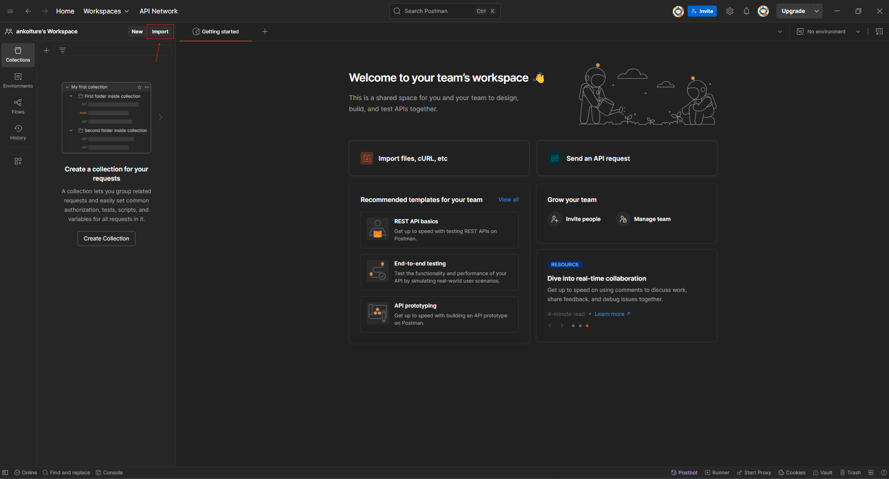

También puedes usar atajos:
- **Windows/Linux:** `Ctrl + O`
- **Mac:** `Cmd + O`

---

### 3. 📁 Selecciona el archivo de la colección

1. En la ventana emergente, selecciona **"Upload Files"**.
2. Haz clic en **"Choose Files"** y selecciona el archivo `.json`.


---

### 4. ✅ ¡Listo!

Tu colección ahora aparece en la barra lateral izquierda, dentro de **Collections**.

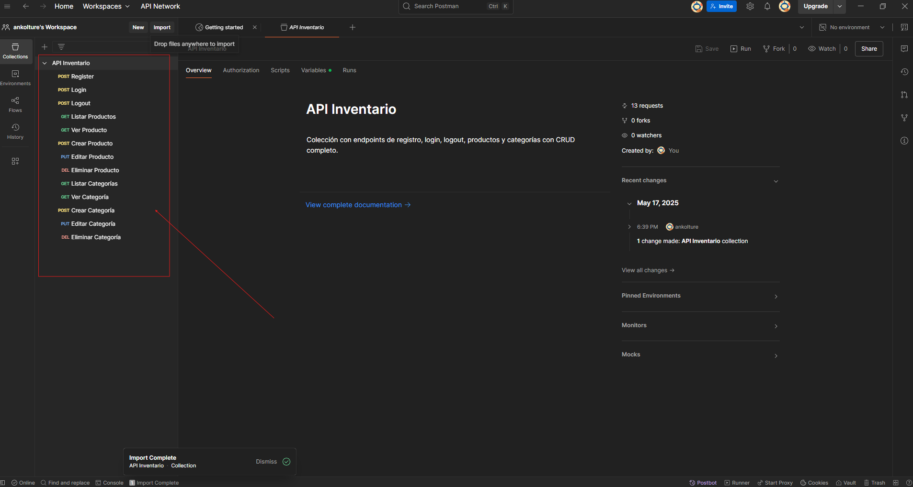


# 📦 API Inventario - Guía de Uso

Este documento describe cómo utilizar la API de Inventario para gestionar productos, categorías y autenticación de usuarios. A través de esta guía podrás realizar operaciones como login, registro, creación, edición y eliminación de productos o categorías.

---

## 🔗 Base URL

Al acceder a la colección de Postman `API INVENTARIO`, en la sección de **Variables** encontrarás la variable `base_url`, que apunta al sitio web.

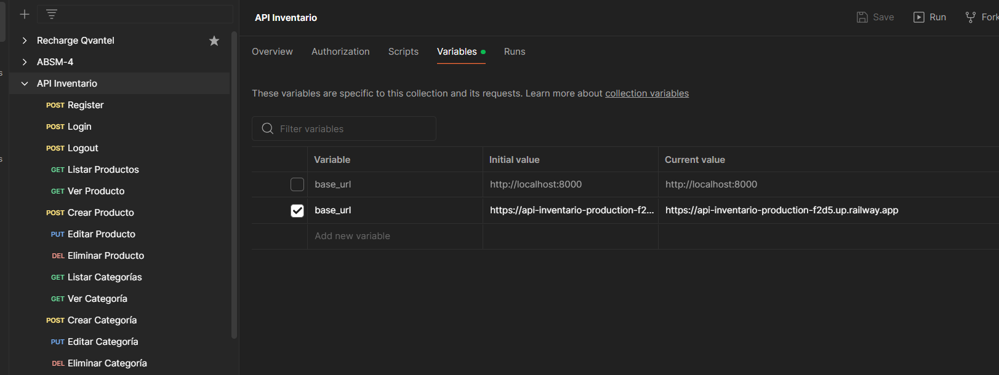

---

## 🔐 Autenticación

### Endpoint: `login`

Para iniciar sesión y obtener un token de autenticación, usa el siguiente body en el endpoint `login`:

```json
{
  "email": "smarttranks@laravel.com",
  "password": "025014"
}
```

Si las credenciales son correctas, recibirás un **token de sesión** que te permitirá acceder a los demás endpoints protegidos (como Logout, Productos, Categorías, etc.).

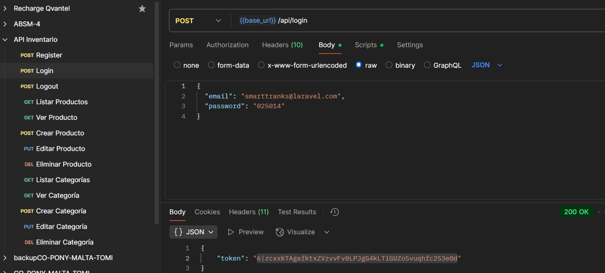

---

## 🔑 Uso del Token

Cada endpoint protegido requiere el uso del token en los **headers** mediante la variable `{{token}}`. Puedes hacer clic en la variable para asignar el token generado en el login.

Ejemplo:


---

## 📋 Endpoints Disponibles

### ✅ Públicos (No requieren autenticación)
- `register`: Registro de nuevos usuarios (sin rol por defecto)

#### Ejemplo body para `register`:

```json
{
  "name": "Maycol Sanchez Salazar",
  "email": "maycol@laravel.com",
  "password": "025014",
  "password_confirmation": "025014",
  "role": "user"
}
```

> ⚠️ Si deseas asignar roles, debes autenticarte como usuario **admin**.

---

### 🔐 Protegidos (Requieren token de autenticación)

#### 🛒 Productos
- `listar productos`
- `ver producto`
- `crear producto`

```json
{
  "name": "Producto Nuevo",
  "description": "Descripción del producto",
  "price": 100.50,
  "category_id": 1,
  "stock": 1
}
```

- `editar producto`
- `eliminar producto` → requiere el `id` en la URL

#### 📁 Categorías
- `listar categorías`
- `ver categoría`
- `crear categoría`
- `editar categoría`
- `eliminar categoría` → requiere el `id` en la URL

#### 👤 Usuarios
- `logout`

---

## 🚀 Notas Finales

- Cada endpoint define en su sección de **body** la estructura necesaria para realizar la operación correspondiente.
- El token debe enviarse siempre en los headers para endpoints protegidos.
- Asegúrate de utilizar la URL base correcta asignada a la variable `base_url`.

Con esta información podrás hacer un uso correcto y completo de la API de Inventario.

---

# 🚀 Configuración para el Despliegue en Railway

## 1. Registro en Railway

- Ingresamos a [https://railway.com/](https://railway.com/) y nos registramos con nuestra cuenta de GitHub.
- Hacemos clic en **Deploy MySQL**.

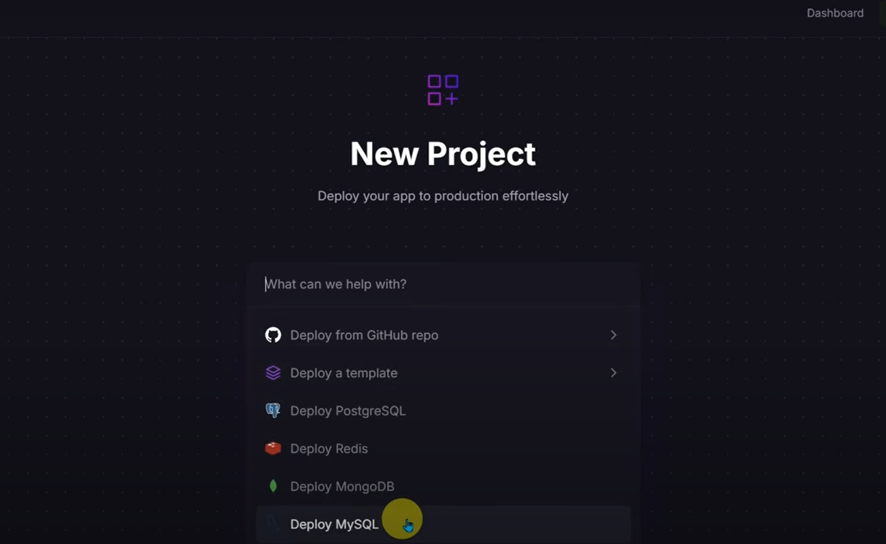

- Esperamos a que se cree la base de datos.

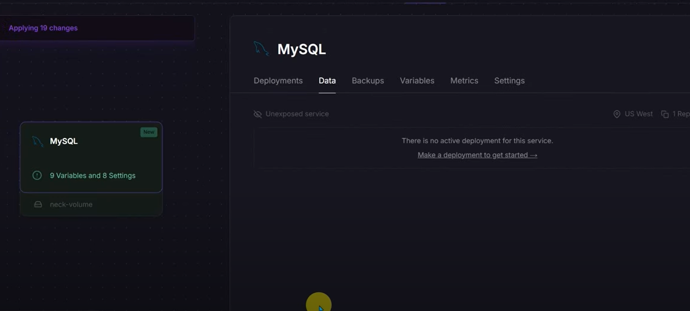

---

## 2. Desplegar Proyecto desde GitHub

- Abrimos una nueva pestaña y seleccionamos **New Project** → **Deploy from GitHub Repo**.

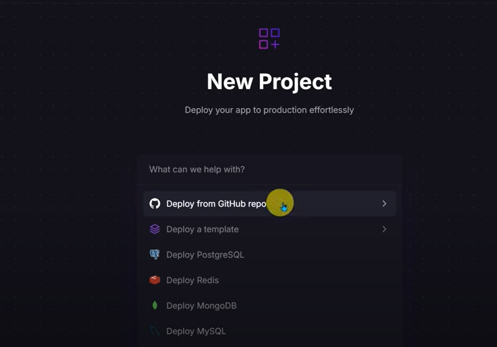

- Luego hacemos clic en **Configure GitHub App**.


- Se abrirá una nueva ventana. Seleccionamos la opción **Only select repositories**, elegimos nuestro repositorio y damos clic en **Install & Authorize**.


- Esperamos a que se cree el proyecto.

- Veremos una pantalla como esta:

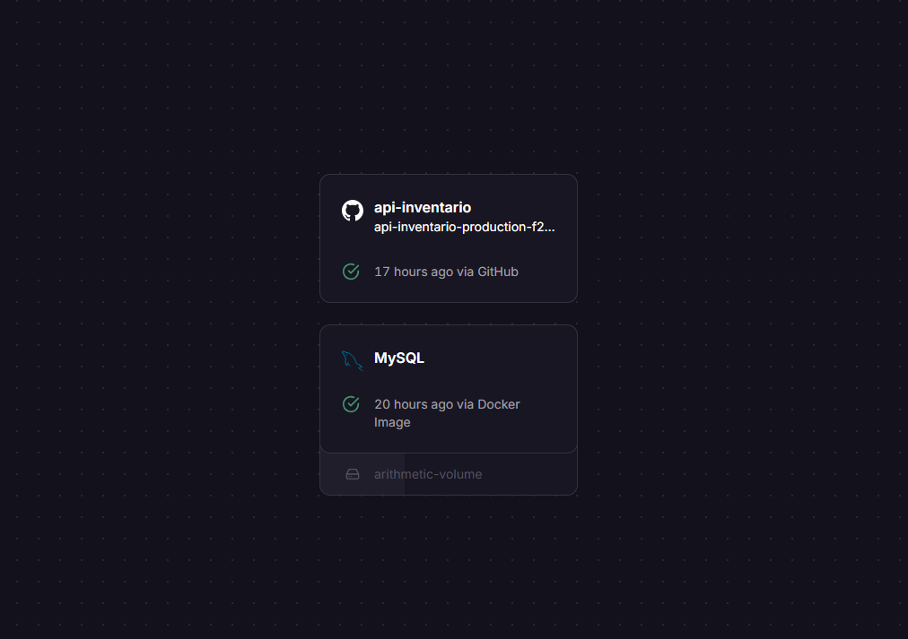

---

## 3. Configurar Variables de Entorno

- Hacemos clic en el repositorio que deseamos desplegar (en este ejemplo, `api-inventario`).

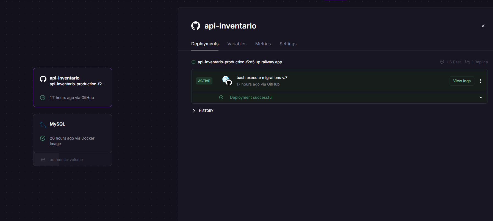

- Luego vamos a la pestaña **Variables** y seleccionamos **Raw Editor**.

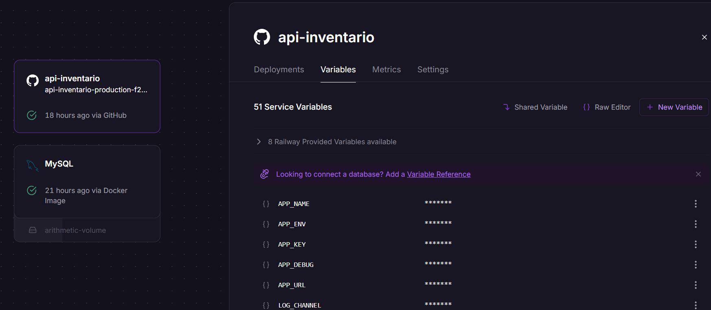

- Visualizaremos un archivo como este:

```env
APP_NAME="Laravel"
APP_ENV="production"
APP_KEY="base64:JANQ54mc1EadI1zw8n/oKAhqr4eq2x2o0ikDL7QINr4="
APP_DEBUG="true"
APP_URL="https://api-inventario-production-f2d5.up.railway.app/"
LOG_CHANNEL="stack"
...
DB_CONNECTION="mysql"
DB_HOST="mysql.railway.internal"
DB_PORT="3306"
DB_DATABASE="railway"
DB_USERNAME="root"
DB_PASSWORD="eQQrQyMhkBkMJvcsbHOrVCRHwDLzFDEN"
...
NIXPACKS_BUILD_CMD="php artisan migrate --force"
```

---

## 4. Reemplazar Variables Críticas

Debemos actualizar los siguientes campos:

```env
DB_CONNECTION="mysql"
DB_HOST="mysql.railway.internal"
DB_PORT="3306"
DB_DATABASE="railway"
DB_USERNAME="root"
DB_PASSWORD="..."
APP_URL="https://api-inventario-production-f2d5.up.railway.app/"
```

### ¿Dónde encontrar estos datos?

- Vamos a la configuración (**Settings**) del proyecto:

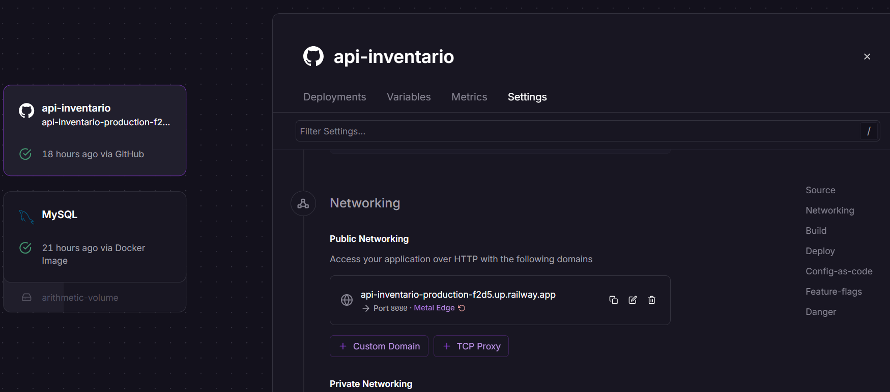

- Allí podemos generar el dominio y configurarlo en el puerto `8080`.

- Para los datos de la base de datos, vamos a **MySQL → Variables**, copiamos los valores y los reemplazamos en el entorno.

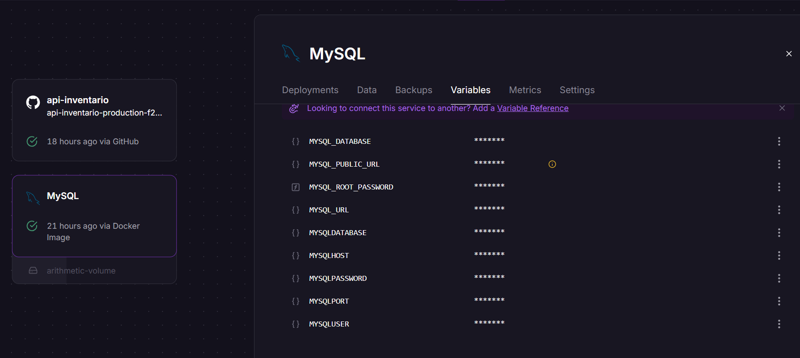

---

## 5. Automatización del Deploy

Una vez configurado todo, cada vez que hagamos un `commit`, Railway actualizará y hará deploy automáticamente.

---

## 6. Archivos Adicionales

Debido a algunos problemas con compatibilidad de versiones, se crearon tres archivos importantes que ya están en el repositorio:

- `Dockerfile`  
- `nginx.config`
- `start.sh`

### ¿Por qué estos archivos?

- Railway por defecto usa PHP 8.1, pero necesitábamos PHP 8.2 para compilar Laravel correctamente y ejecutar migraciones.
- El `Dockerfile` crea un contenedor con PHP 8.2 y sus extensiones necesarias.
- También se expone el puerto `8080`.
- El archivo `start.sh` ejecuta las migraciones y configura Nginx con `nginx.config`.

---

## ✅ ¡Listo!

Tu API estará accesible y podrás probar todos los endpoints con Postman o cualquier cliente HTTP.


# 🧠 Patrones de Diseño en el Proyecto Laravel API

Este proyecto implementa varios **patrones de diseño** fundamentales para mantener el código limpio, escalable y fácil de mantener. A continuación, se detallan los principales patrones utilizados:

---

## 📦 MVC (Model - View - Controller)

Laravel trabaja por defecto con el patrón **MVC**, y en este proyecto seguimos su estructura:

- ### 🧩 **Models**
  Representan los datos y la lógica del negocio.  
  Ejemplos:
  - `User`
  - `Product`
  - `Category`  
  Incluyen validaciones, relaciones entre modelos, etc.

- ### 🖼️ **Views**
  > 🚫 No aplican en este proyecto, ya que es una **API REST** y no hay interfaces gráficas.

- ### 🧠 **Controllers**
  Manejan la lógica de las peticiones HTTP y actúan de intermediarios entre los Models y las respuestas JSON.  
  Controladores utilizados:
  - `AuthController`
  - `ProductController`
  - `CategoryController`

---

## 🛡️ Middleware Pattern

Se utilizan **middlewares** para:

- ✅ **Autenticación**: `auth:sanctum`
- 🛑 **Autorización**: `isAdmin`

Este patrón permite **interceptar y procesar solicitudes** antes de que lleguen a los controladores, lo que:

- Desacopla la lógica de seguridad del resto de la aplicación.
- Facilita el manejo de logs y excepciones.
- Permite validar accesos y roles de forma centralizada.

---

## 🎯 Strategy Pattern

Para la autenticación y control de accesos se aplican diferentes estrategias:

- Uso de **tokens** con Sanctum.
- Validación de **roles** (por ejemplo, usando el método `isAdmin` en el middleware).

De esta forma, se controla el acceso a diferentes partes de la API dependiendo del rol del usuario.

---

## ⚠️ Exception Handling

Se implementa una clase `Handler` para el **manejo centralizado de excepciones y errores**, lo que permite:

- Mensajes de error más claros y entendibles.
- Respuestas uniformes para los errores.
- Mejor experiencia para los consumidores de la API.

---

## 🧬 Fluent Interface (Eloquent ORM)

Laravel Eloquent utiliza una **interfaz fluida** que permite encadenar métodos para hacer consultas más legibles:

```php
$products = Product::where('category_id', 1)
                   ->orderBy('name')
                   ->get();
```


# 📘 Decisiones de Diseño

## 🎭 Elección de Enum vs Tabla de Roles

Se eligió usar un campo `enum` para el rol principalmente porque fue sugerido en el modelo de datos, y debido a que la cantidad de roles es muy limitada (solo dos), no se requería una solución compleja para manejar permisos especiales.

✅ El uso de un `enum`:
- Evita consultas adicionales a la base de datos.
- Simplifica la lógica de autorización en el middleware.

📌 Una **tabla de roles** sería más adecuada cuando:
- Hay muchos roles.
- Cada rol tiene múltiples permisos asociados.
- Se necesita una lógica más compleja y flexible.

---

## 🛡️ Middleware Personalizado vs Paquete de Autorización

Se implementó un middleware personalizado llamado `IsAdmin`.

🎯 Ventajas del middleware personalizado:
- Más sencillo y directo.
- Permite control total sobre la lógica de acceso.
- Más visual y transparente al implementarlo.

🔐 Considerando que hay pocos roles, no se justifica usar un paquete robusto de autorización.  
Un paquete externo sería útil en proyectos más grandes y con reglas complejas de permisos.

---

## 🧩 Cambios al Esquema de Base de Datos

Se agregó una columna `role` a la tabla `users` (existente por defecto en Laravel).

📍 Beneficios:
- Aprovecha la tabla existente sin crear nuevas estructuras.
- Permite distinguir usuarios administradores de usuarios normales fácilmente.
- Facilita la lógica de permisos desde el middleware según el rol asignado.

---

## 🔐 Cambios en los Endpoints Originales

🚧 Se protegieron rutas sensibles como crear, actualizar y eliminar recursos con los middlewares `auth:sanctum` e `isAdmin`.

🧾 Reglas:
- ✅ Solo usuarios **autenticados** pueden acceder a los endpoints.
- 🛑 Solo **administradores** pueden realizar acciones de escritura (crear, actualizar, eliminar).

### 🧪 Ejemplo de ruta protegida:

```php
Route::middleware('isAdmin')->group(function () {
    Route::post('products', [ProductController::class, 'store']);
});
```
